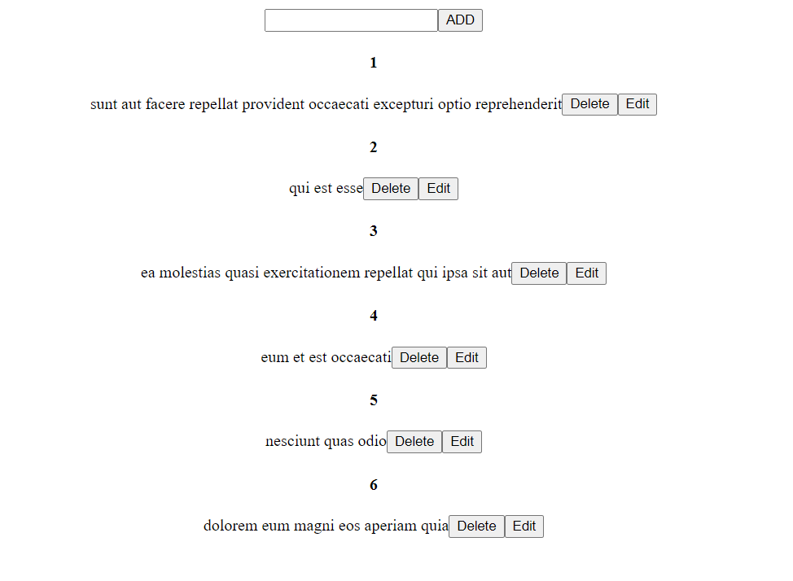

## Tech Stack & Working
Created using React and JSONPlaceholder which is a free online REST API
## Available Scripts

In the project directory, you can run:

### `npm start`

Runs the app in the development mode.\
Open [http://localhost:3000](http://localhost:3000) to view it in your browser.

The page will reload when you make changes.\

## Showcase 
<table align="center">
    <tr>
        <td>
            <a href="https://github.com/Virajj28/Message-Board/blob/main/image/Home.png">
                

                    
                    
Home Page

                

            </a>
        </td>
    </tr>
</table>
